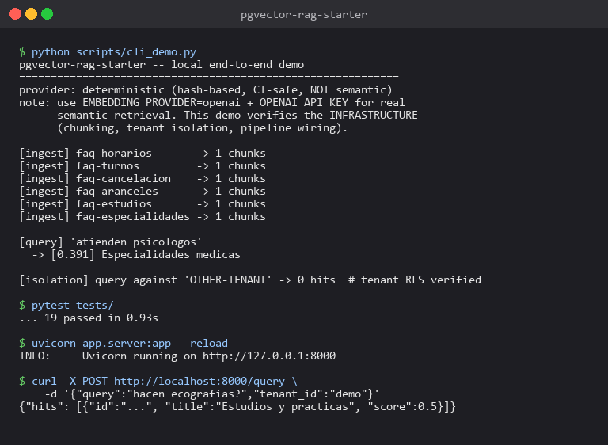

# pgvector-rag-starter

[](https://github.com/sarteta/pgvector-rag-starter/actions/workflows/tests.yml)
[](https://www.python.org)
[](./LICENSE)

A tiny, honest RAG reference implementation in FastAPI + Python. Drop-in
Postgres/pgvector schema with Row-Level Security for multi-tenant apps.
Ships with a deterministic pseudo-embedding provider so the full
pipeline runs in CI and on a laptop with no API keys.



## What this is

- A **working reference**, not a library. Clone it, rip out the parts
  you don't want, plug in your real embedding + vector-store providers.
- **Multi-tenant by default.** Tenant id travels through the pipeline
  and the included Postgres schema enables RLS so a bug in the
  application layer can't accidentally leak tenant A's documents to
  tenant B.
- **Testable end-to-end without external services.** The
  `DeterministicEmbedding` provider produces stable (not semantic)
  vectors from SHA-256, so ingest/search/API tests pass in plain CI.
  For real retrieval quality, set `EMBEDDING_PROVIDER=openai`.

## What this is NOT

- A production RAG framework. No reranking, no query rewriting, no
  semantic chunking, no hybrid BM25+dense search, no evals. When
  retrieval quality matters for your app, pair it with
  [`whatsapp-rag-eval-kit`](https://github.com/sarteta/whatsapp-rag-eval-kit)
  to measure it honestly.
- Opinionated about the LLM side. The `/query` endpoint returns hits;
  passing those hits to Claude/GPT and getting an answer is your job,
  because every app wants that prompt template to be different.

## Quickstart

```bash
pip install -r requirements-dev.txt
pytest tests/ -v
python scripts/cli_demo.py
```

Or run the API:

```bash
uvicorn app.server:app --reload
```

Then:

```bash
curl -X POST http://localhost:8000/ingest \
  -H "Content-Type: application/json" \
  -d '{
    "doc_id": "faq-horarios",
    "tenant_id": "demo",
    "title": "Horarios",
    "body": "Atendemos de lunes a viernes de 9 a 18 hs."
  }'

curl -X POST http://localhost:8000/query \
  -H "Content-Type: application/json" \
  -d '{"query": "a que hora abren", "tenant_id": "demo"}'
```

## Architecture

```
   HTTP              embedding        store
 /ingest ->   chunks ---embed--->   upsert
                                      |
 /query  ---embed query----> cosine search (tenant-scoped)
                                      |
                                    HitOut JSON
```

Four small pieces:

| file | role |
|------|------|
| `app/chunking.py` | Sentence-boundary chunker with overlap. Naive, <100 LOC. |
| `app/embeddings.py` | `EmbeddingProvider` protocol + `Deterministic` (demo) + `OpenAI` impls. |
| `app/store.py` | `VectorStore` protocol + `InMemoryStore` + SQL template for pgvector. |
| `app/pipeline.py` | `Pipeline.ingest()` / `Pipeline.query()`. This is where swaps happen. |
| `app/server.py` | FastAPI with `/ingest`, `/query`, `/health`. |

## Swap in pgvector

The full schema + RLS skeleton is in
[`docs/pgvector-schema.sql`](./docs/pgvector-schema.sql). Key points:

```sql
CREATE EXTENSION IF NOT EXISTS vector;

CREATE TABLE chunks (
  id          TEXT PRIMARY KEY,
  tenant_id   TEXT NOT NULL,
  doc_id      TEXT NOT NULL,
  title       TEXT,
  body        TEXT NOT NULL,
  embedding   vector(1536) NOT NULL,
  metadata    JSONB NOT NULL DEFAULT '{}'::jsonb,
  created_at  TIMESTAMPTZ NOT NULL DEFAULT now()
);
CREATE INDEX ON chunks USING hnsw (embedding vector_cosine_ops);

ALTER TABLE chunks ENABLE ROW LEVEL SECURITY;
CREATE POLICY chunks_tenant_isolation ON chunks
  USING (tenant_id = current_setting('app.tenant_id', true));
```

Your application code sets `SET LOCAL app.tenant_id = ...` at the start
of every request's transaction, and **never** interpolates the tenant
id into SQL directly. That's the contract: a bug in the retrieval
handler becomes a `zero rows returned` — not a cross-tenant leak.

## Tests (19)

- Chunking boundaries + overlap
- Cosine math edge cases (identical, orthogonal)
- Store-level upsert + count + reset
- **Tenant isolation at the store layer** (wrong tenant sees 0 hits)
- **Tenant isolation at the pipeline layer** (query for A-only content
  against tenant B returns 0 hits)
- Pipeline ingest produces ≥1 chunk for non-empty input, 0 for empty
- Pipeline query returns the correct doc when the exact text is present
- API: health, happy-path ingest+query, empty-body 400, empty-query 400

Run: `pytest tests/ -v`

## Roadmap

- [ ] Real pgvector adapter + psycopg/asyncpg implementation
- [ ] Reranker pass (cross-encoder or Cohere rerank)
- [ ] Hybrid search (dense + BM25 lexical merge)
- [ ] Streaming answer endpoint using Claude / Anthropic SDK
- [ ] Batch ingest CLI
- [ ] Portuguese seed data for BR market

## License

MIT © 2026 Santiago Arteta
